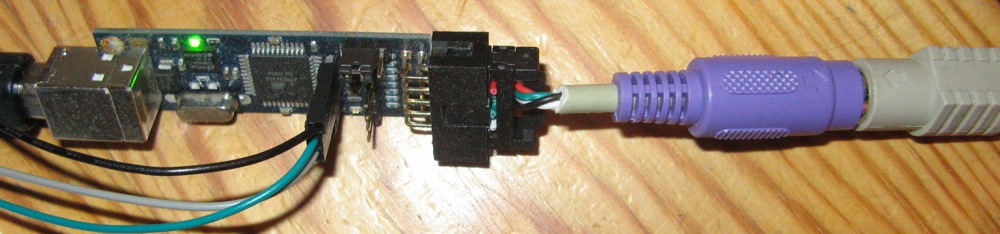

# ps2toUsb
PS/2 to USB converter, based on an AVR

### What works

-All but one key on my TATEL-K282 S26381-K257-L120 Siemens Nixdorf keyboard

-Sending the LED state back from the host

-Macro recorder and playback

### What does not

-The BIOS does not detect the keyboard (yes, this is a show stopper)

-The power on/off button on the keyboard does not send a scancode

### Schematics and contribution

This project is based on other open-source projects.

You can find the schematic of USBprog 3.0 here:
[ykhalyavin/usbprog/board/610000022A.pdf](https://github.com/ykhalyavin/usbprog/blob/master/board/610000022A.pdf)
It was a commercially available product, but seems to be discontinued.

You just have to connect PS/2 clock to PortB.2 and PS/2 data to PortB.1.

The sourcecode of which this project is based on, can be found in the repository too:
[ykhalyavin/usbprog/simpleport_rs232](https://github.com/ykhalyavin/usbprog/tree/master/simpleport_rs232)

The sourcecode for decoding the PS/2 protocol is a modified version from:
[LIV2/AVR-PS2-KBC](https://github.com/LIV2/AVR-PS2-KBC)

